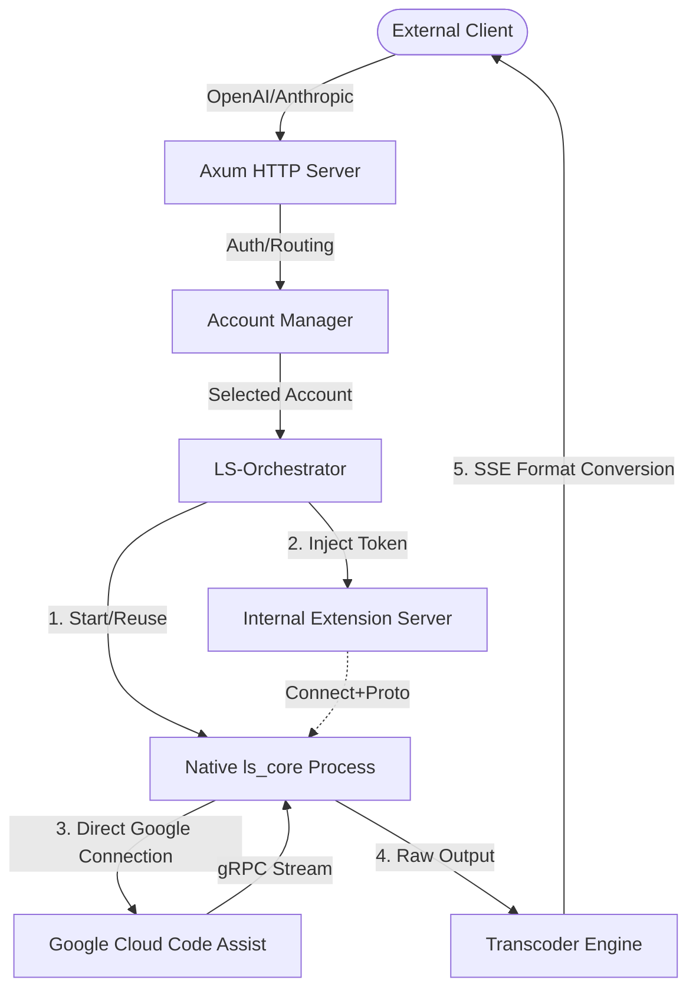

<div align="center">

[🇨🇳 中文配置指南](README_ZH.md) | [🇺🇸 English Documentation](README.md)

# 🚀 Antigravity Tools LS

> **Professional Language Server Protocol Transcoding Bridge (v0.0.3)**

<p align="center">
  
  
  
  
  
</p>

<h3>High-Performance Native-Driven AI Protocol Adapter Gateway</h3>

**Antigravity-Tools-LS** is a local proxy bridge system designed specifically for the Antigravity IDE. It is not just a simple forwarder; instead, by deeply simulating the IDE plugin protocol, it fully takes over the lifecycle of the native `ls_core` process to provide the ultimate solution for authentication injection, protocol transcoding, and multi-account dispatching.

> [!IMPORTANT]
> **Project Status**: This project is currently in the **Early Experimental Stage (Experimental)**, and many features (such as Thinking extraction) are still under development. **Due to the author's busy work schedule, project updates may not be very frequent.** We strongly welcome developers to submit **Pull Requests (PR)** or Issues to co-maintain and improve this tool.

<p align="center">
  <a href="#-core-concept-what-is-this">Core Concept</a> • 
  <a href="#-features">Features</a> • 
  <a href="#-architecture">Architecture</a> • 
  <a href="#-deployment-guide">Deployment</a> • 
  <a href="#-asset--version-sync">Asset & Version</a> • 
  <a href="#-api-reference">API Reference</a>
</p>

</div>

---

## ☕ Support the Project

If you find this project helpful, please consider supporting the author!

<a href="https://www.buymeacoffee.com/Ctrler" target="_blank"></a>

| Alipay | WeChat Pay | Buy Me a Coffee |
| :---: | :---: | :---: |
|  |  |  |

---

## 🧠 Core Concept (What is this?)

This project adopts a **Pure Native LS Path** technical architecture:
It exposes standard OpenAI / Anthropic / Gemini APIs externally, while internally delegating requests entirely to the native **Antigravity Language Server (`ls_core`)** process.

Unlike Antigravity-Manager, this system will:
1. **Hold Real Credentials**: Simulate the Extension Server behavior to inject OAuth Tokens into `ls_core`.
2. **Establish Native Connections**: The `ls_core` process establishes an HTTPS/gRPC connection directly with Google backend, ensuring the request characteristics are 100% identical to the official plugin.
3. **Protocol-Aware Transcoding**: Parse the streaming output of `ls_core` at the application layer to extract Tool Call tags, image generation results, and Cascade agent states.

---

## ✨ Features

### 🌊 Deep Protocol Bridging
- **Multi-Protocol Adaptation (Multi-Sink)**: Unified conversion from native protocols to OpenAI (`/v1/chat/completions`), Anthropic (`/v1/messages`), and Gemini Native APIs.
- **Connect+Proto Spoofing**: Fully implements the `SubscribeToUnifiedStateSync` interface, supporting real-time Token updates pushed to memory without restarting the LS process.
- **Cascade Agent Support**: Natively unlocks Cascade Agent mode, supporting stronger context planning and logical reasoning, as well as echoing search citations and sources.

### 🔄 One-Click IDE Account Switching
- **Database-Level Injection**: Automatically identifies macOS/Windows/Linux IDE paths and modifies `state.vscdb` using atomic writes.
- **Seamless Switching**: Automatically force-closes the IDE process, executes Token injection, and automatically restarts (on supported platforms), completely freeing you from manual logins.

### 📦 Industrial-Grade Asset Provisioner
- **Multi-Platform Package Engine**: Supports automatic extraction of `ls_core` and certificates from `.dmg` (macOS), `.deb` (Linux), `.exe` (Windows), and `.tar.gz`.
- **Multi-Level Sync Strategy**: Provides three modes: `Auto` (smart comparison), `LocalOnly` (from local install), and `ForceRemote` (force cloud pull).

### 🛡️ System Governance & Stability
- **LRU Instance Pool Management**: Automatically reclaims expired LS process instances via the LRU strategy to optimize system resource usage.
- **Atomic Configuration Persistence**: All global settings, account ordering, and API Keys are protected by atomic writes to prevent configuration corruption from power loss.
- **Real-Time Event Push**: Frontend echo provided in milliseconds via an SSE-based stream for account changes, task progress, and traffic monitoring.

---

## 🏗 Architecture

### Data Flow


### Core Packages
- **`transcoder-core`**: Core transcoding engine. Responsible for gRPC stream to SSE conversion, and XML tags to structured JSON parsing.
- **`ls-orchestrator`**: Process orchestration layer. Manages TTL cleanup, LRU reclaim, and Token injection for `ls_core` instances.
- **`ls-accounts`**: Storage layer. Manages SQLite-based account pool, quota details, and authentication stats.
- **`cli-server`**: Application gateway. Aggregates routing, asset provisioning engine, and Web Dashboard static resources.
- **`desktop`**: Desktop application. Cross-platform client built on Tauri (WIP).

---

## 🚀 Deployment Guide

### One-Click Install Script (Recommended)

**Linux / macOS:**
```bash
curl -fsSL https://raw.githubusercontent.com/lbjlaq/Antigravity-Tools-LS/main/install.sh | bash
```

**Windows (PowerShell):**
```powershell
irm https://raw.githubusercontent.com/lbjlaq/Antigravity-Tools-LS/main/install.ps1 | iex
```

#### macOS - Homebrew
If you have [Homebrew](https://brew.sh/) installed, you can also install via:

```bash
# 1. Tap the repository
brew tap lbjlaq/antigravity-tools-ls https://github.com/lbjlaq/Antigravity-Tools-LS

# 2. Install the application
brew install antigravity-tools-ls
```

### Build from Source
```bash
# Clone the repository
git clone https://github.com/lbjlaq/Antigravity-Tools-LS.git && cd Antigravity-Tools-LS

# Compile and run (default port 5173)
RUST_LOG=info cargo run --bin cli-server

# Use a custom backend port
PORT=5188 RUST_LOG=info cargo run --bin cli-server

# If you also run the Vite dashboard in dev mode, point the proxy to the same backend
VITE_BACKEND_PORT=5188 npm --prefix apps/web-dashboard run dev
```

### Docker Deployment
Running via Docker on NAS or servers is recommended for optimal lifecycle management:
```bash
docker run -d \
  --name antigravity-ls \
  -p 5188:5188 \
  -e PORT=5188 \
  -e RUST_LOG=info \
  -v ~/.antigravity-ls-data:/root/.antigravity_tools_ls \
  lbjlaq/antigravity-tools-ls:latest
```

> [!CAUTION]
> **Workspace Visibility Limitations in Remote Docker Deployment**:
> When deploying this project via Docker on a remote server (e.g., VPS or NAS), the LS engine inside the container **cannot directly read** your local workspace code files.
> - **Reason**: Filesystems across different devices are physically isolated. Processes inside the container can only access paths within the container or those mounted via Volumes.
> - **Impact**: While API forwarding will work, advanced features like "Project-wide Code Search" or "Symbol Definitions" (which depend on context) will fail because the LS engine cannot locate the source code.
> - **Recommendation**: For full functionality, ensure the LS service and your code files share the same filesystem view (i.e., run the Docker or binary locally on your development machine).

> [!WARNING]
> **Low Memory OOM Warning**: High concurrency queries may cause `ls_core` to instantly allocate a massive amount of memory (peak >2GB). When deploying on servers with less than 2GB RAM, **you must configure at least 5GB of Swap**. See the [OOM Troubleshooting Guide](./docs/Linux_Deployment_OOM_Guide.md) for details.

> [!IMPORTANT]
> **Notice for Windows Users (ASSET SYNC DEPENDENCY)**:
> To enable "Zero-Config Asset Sync" (automatic download and extraction of the core), **7-Zip** must be installed, and the `7z` executable must be in your system `PATH`.
> **Recommended**: Install via `scoop install 7zip` or `choco install 7zip`.
> **Manual Alternative**: If you prefer not to install 7-Zip, manually place the extracted `ls_core` and `cert.pem` from the official installer into the `bin/` directory.

---

## 🔧 Zero-Config Asset & Version Sync

This project has **bidirectional self-healing capabilities for assets and versions**. The system automatically ensures strict consistency between the runtime `ls_core` binary and the version model signature (`simulated_version`) sent to Google, completely eliminating manual intervention.

### 1. Automatic Alignment Mechanism
- **Local Adaptation**: Automatically scans system paths on startup. If a newer local installation of Antigravity is detected, the system **automatically extracts** core assets and **synchronizes internal simulated version numbers**.
- **Cloud Hot-Update**: If no local installation is found or assets are missing, the system fetches the latest `execution_id` from the official auto-update API and streams down the appropriate asset packages for the platform to perform atomic replacements.
- **Version Persistence**: The aligned version number is recorded in `data/ls_config.json`, ensuring subsequent Request Header signatures perfectly match the physical binary versions and fundamentally preventing `403 Forbidden` errors.

### 2. Asset Provisioning Strategies
Can be dynamically switched via `PUT /v1/settings` or environment variables:
- `Auto` (Default): Local priority. Falls back to Cloud if native App isn't installed locally.
- `LocalOnly`: Strictly extracts only from locally installed Apps. Ideal for offline or restricted environments.
- `ForceRemote`: Ignores local Apps and forcefully pulls the latest assets from cloud repositories.

### 3. Manual Fallback
Although the system supports fully automatic alignment, you can manually override:
- **Manual Drop**: Place `ls_core` and `cert.pem` directly into the `bin/` directory.
- **Config Override**: Modify the `version` field in `data/ls_config.json` to override the simulated version.

## 🤖 Models & Usage

The scope of supported models and usages is highly consistent with the **Antigravity** series.

### 1. Supported Models List
The Model Alias forwarding feature has not yet been achieved. An exact Model ID **must be stringently used** during API requests:

| Provider | Model ID |
|---|---|
| **Gemini** | `gemini-3.1-pro-high`, `gemini-3.1-pro-low`, `gemini-3-flash-agent` |
| **Claude** | `claude-sonnet-4-6`, `claude-opus-4-6-thinking` |
| **Others** | `gpt-oss-120b-medium` |

### 2. Special Limitations
- **Image Generation Models**: Directly calling the image-generation endpoint is not supported yet. Image generation capabilities can only be indirectly triggered via other models calling the support tools.
- **Chain of Thought (Thinking)**: **[Core Notice]** The current version has not yet implemented the streaming extraction and echoing of the `Thinking` process. This feature has been added to the roadmap and is under active development.

---

## 📡 API Reference

### Proxy Endpoints
| Method | Path | Protocol Format |
|---|---|---|
| `POST` | `/v1/chat/completions` | OpenAI Chat (Stream Support) |
| `POST` | `/v1/messages` | Anthropic Claude |
| `POST` | `/v1beta/models/:model` | Google Gemini SDK |
| `POST` | `/v1/responses` | OpenAI Responses API |

### System Governance Endpoints
| Method | Path | Function |
|---|---|---|
| `GET` | `/v1/instances` | View active LS instance pool |
| `DELETE` | `/v1/instances/:id` | Manually reclaim/terminate LS instance |
| `GET` | `/v1/provision/status` | Query asset sync status and paths |
| `POST` | `/v1/provision/sync` | Force trigger asset realignment |

---

## 📝 Narrative Changelog

### v0.0.3 - Protocol Adaptation & Sandbox Bypass (2026-03-26)
- **[Frontend UI] Dashboard Integrity Status Fix**: Introduced a "CHECKING" status to resolve the issue where the Dashboard homepage incorrectly displayed as "DEGRADED" before core asset data finished loading, eliminating initial screen warning flicker.
- **[Core] Sandbox Isolation Bypass**: Removed the virtual workspace restriction (`/tmp/antigravity_workspace`) for the Cascade Agent, fully unlocking the AI agent's ability to read arbitrary local codebase directories on the host machine.
- **[Protocol] Claude CLI Deep Compatibility**: Fixed strict `usage` payloads in Anthropic streaming outputs and added a `/v1/messages/count_tokens` preflight mock endpoint to perfectly support Cherry Studio and the official Claude CLI tool.
- **[Reliability] Fallback Model Injection**: Automatically injects preset/default models (e.g., `gemini-3.1-pro-high`) into memory and the frontend UI when quota detection fails or new accounts haven't synced models, preventing blank UI screens and missing API models.
- **[Provisioner] Strengthened Local-First Validation**: Optimized `AssetProvisioner` logic to immediately skip meaningless cloud downloads once an aligned locally installed Antigravity version is sniffed, speeding up the server startup.
- **[Protocol] Native Gemini Client Integration**: Engineered support for `x-goog-api-key` headers and automatically intercepts/strips operation suffixes (e.g., `:streamGenerateContent`) from model paths at the gateway, unlocking drop-in compatibility for official Gemini ecosystem tools.
- **[Engine] Aligned LS Core Launch Signatures**: Adopted security adaptations targeting recent Antigravity native engines, transitioning to `-https_server_port` and injecting mandatory bidirectional CSRF tokens for Cascade agents to eradicate strict connection-reset issues.
- **[Session] Zero-IO Identity Tracking**: Deprecated high-frequency disk-reads of local `.gemini` authorization files during identity evaluations, swapped to rapid memory-bound MD5 fingerprint checks, mitigating heavy file operations and concurrency contention.
- **[Port Config] Full-Link Custom Backend Port**: Eliminated all hardcoded `5173` port references. Now supports configuring the backend port via CLI, env vars, or directly in the **Dashboard Settings page**, with automatic adaptation for Tauri bridging and OAuth flows.
- **[Accounts] Account Status Misjudgment Fix (Issue #13)**: Optimized the Google subscription tier recognition algorithm, resolving the issue where normal free accounts were incorrectly flagged as "Restricted/Banned," and added support for automatic status recovery.

### v0.0.2 - Containerization & Dependency Optimization (2026-03-25)
- **[Docker] Runtime Self-Healing**: Resolved startup crashes in `debian:bookworm-slim` by adding minimal required libraries for `ls_core` (`libnss3`, `libgbm1`, etc.).
- **[Core] Decoupled GUI Dependencies**: Refactored `rfd` (file dialog) as an optional feature. Docker builds now automatically exclude GTK/Wayland links, maintaining a minimal image size.
- **[API] Environment-Aware Fallback**: Optimized path selection APIs to return user-friendly errors in headless environments instead of crashing.

### v0.0.1 (Experimental) - Initial Core Features Release
This version finalizes project initiation and infrastructure. Major functionalities include:
- **[Core Engine] Pure Native LS Bridging**: Transparent full-stack gateway seamlessly connecting to Google via the IDE's native protocol by fully managing the `ls_core` lifecycle.
- **[Cross-Platform] Atomic Account Switching**: Breakthrough parsing of the `state.vscdb` Protobuf schema, enabling macOS/Windows/Linux automated credential extraction and isolated injection.
- **[Transcoder] Multi-Sink Streaming Adapters**: First-to-market support for real-time transcoding of native raw texts / structured responses into Standard OpenAI Chat, Anthropic Messages, and Native Gemini APIs.
- **[Governance] Fully Auto Asset Sync**: Built-in intelligent sync system decides self-governed sourcing (extract local App or Cloud downloading) based on host environments, maintaining flawless version alignments to prevent bans.
- **[System Resources] LRU Reclaim Defense**: Realized timeout detection for persistent processes, forcing the cleanup of zombie `ls_core` processes to avoid OOM in lightweight containers.

---

## 📄 License & Security Statement

> [!CAUTION]
> **Risk Warning**: This project is exclusively for **personal technical research and study**. All behaviors generated through this project (including but not limited to calling upstream APIs, automated tasks) are at the user's sole risk. The author does not guarantee stability or compliance and assumes no legal liability or account ban risks resulting from its usage.

- **Copyright License**: Licensed under **[CC BY-NC-SA 4.0](https://creativecommons.org/licenses/by-nc-sa/4.0/)**, **ALL commercial operations are strictly prohibited**.
- **Usage Disclaimer**: This code is strictly for educational exchanges, please refrain from using it for illegal purposes or integrating it into production environments.
- **Security Statement**: This project operates strictly locally. All credentials (OAuth Tokens) and logs are encrypted and stored inside the local SQLite database. Data will never leave your device unless exported actively or explicit Cloud Sync is enabled.

<p align="center">Made with Rust 🦀 by [lbjlaq](https://github.com/lbjlaq)</p>
