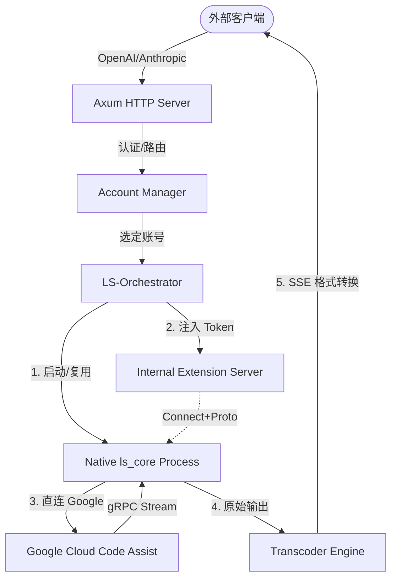

<div align="center">

[🇨🇳 中文配置指南](README_ZH.md) | [🇺🇸 English Documentation](README.md)

# 🚀 Antigravity Tools LS

> **专业级 Language Server 协议转码桥接器 (v0.0.3)**

<p align="center">
  
  
  
  
  
</p>

<h3>高性能原生驱动的 AI 协议适配网关</h3>

**Antigravity-Tools-LS** 是专为 Antigravity IDE 开发的本地代理桥接系统。它不仅仅是一个简单的转发器，而是通过深度模拟 IDE 插件协议，完整接管原生 `ls_core` 进程的生命周期，实现认证注入、协议转码与多账号调度的终极解决方案。

> [!IMPORTANT]
> **项目状态**: 本项目目前处于**早期实验阶段 (Experimental)**，许多功能（如 Thinking 提取）仍在开发中。**由于作者工作较忙，项目更新可能不会过于频繁。** 我们非常欢迎开发者提交 **Pull Request (PR)** 或 Issue 来共同维护与完善这个工具。

<p align="center">
  <a href="#-项目核心-what-is-this">项目核心</a> • 
  <a href="#-功能特性">功能特性</a> • 
  <a href="#-技术架构">技术架构</a> • 
  <a href="#-部署指南">部署指南</a> • 
  <a href="#-资产维护与版本对齐">资产与版本</a> • 
  <a href="#-API-参考">API 参考</a>
</p>

</div>

---

## ☕ 支持项目 (Support)

如果您觉得本项目对您有所帮助，欢迎打赏作者！

<a href="https://www.buymeacoffee.com/Ctrler" target="_blank"></a>

| 支付宝 (Alipay) | 微信支付 (WeChat) | Buy Me a Coffee |
| :---: | :---: | :---: |
|  |  |  |

---

## 🧠 项目核心 (What is this?)

本项目采用**纯原生 LS 链路 (Pure Native LS Path)** 技术架构：
对外暴露标准的 OpenAI / Anthropic / Gemini API，内部则将请求完整委托给原生的 **Antigravity Language Server (`ls_core`)** 进程。

与 Antigravity-Manager 不同，本系统会：
1. **持有真实凭证**：模拟 Extension Server 行为，向 `ls_core` 注入 OAuth Token。
2. **建立原生连接**：由 `ls_core` 进程自行建立 HTTPS/gRPC 连接直连 Google 后端，确保请求特征与官方插件 100% 一致。
3. **协议感知转码**：在应用层解析 `ls_core` 的流式输出，提取 Tool Call 标签、图像生成结果及 Cascade 智能体状态。

---

## ✨ 功能特性

### 🌊 深度协议桥接
- **多协议适配 (Multi-Sink)**：统一转换 OpenAI (`/v1/chat/completions`)、Anthropic (`/v1/messages`) 和 Gemini 原生协议。
- **Connect+Proto 伪装**：完整实现 `SubscribeToUnifiedStateSync` 接口，支持向内存中实时推送 Token 更新，无需重启 LS 进程。
- **Cascade 智能体支持**：原生解锁 Cascade Agent 模式，支持更强的上下文规划与逻辑推理，并能回显搜索引文与来源。

### 🔄 IDE 账号一键切换
- **数据库级注入**：自动识别 macOS/Windows/Linux 三端 IDE 路径，通过原子写技术修改 `state.vscdb`。
- **无感秒换**：自动强制关闭 IDE 进程并执行 Token 注入后（受支持平台）实现自动重启，彻底摆脱手动登录烦恼。

### 📦 工业级资产供给 (Asset Provisioner)
- **四平台包引擎**：支持从 `.dmg` (macOS)、`.deb` (Linux)、`.exe` (Windows) 及 `.tar.gz` 中自动提取 `ls_core` 与证书。
- **多级同步策略**：提供 `Auto` (智能比对)、`LocalOnly` (本地提取)、`ForceRemote` (云端强制拉取) 三种模式。

### 🛡️ 系统治理与稳定性
- **LRU 实例池管理**：通过 LRU 策略自动回收过期的 LS 进程实例，优化系统资源占用。
- **原子化配置持久化**：所有全局设置、账号排序与 API Key 均采用原子写保护，防止断电导致配置损坏。
- **实时事件推送**：基于 SSE 的账号变更、任务进度与流量监控流，为前端提供毫秒级回显。

---

## 🏗 技术架构 (Architecture)

### 数据流向 (Data Flow)


### 核心分包说明
- **`transcoder-core`**：核心转码引擎。负责 gRPC 流到 SSE 的转化，以及 XML 标签到结构化 JSON 的解析。
- **`ls-orchestrator`**：进程编排层。管理 `ls_core` 实例的 TTL 清理、LRU 回收及 Token 注入。
- **`ls-accounts`**：存储层。管理基于 SQLite 的账号池、配额详情与认证状态。
- **`cli-server`**：应用网关。聚合路由、资产供给引擎及 Web Dashboard 静态资源。
- **`desktop`**：桌面端应用。基于 Tauri 构建的跨平台客户端（进行中）。

---

## 🚀 部署指南

### 一键安装脚本 (推荐)

**Linux / macOS:**
```bash
curl -fsSL https://raw.githubusercontent.com/lbjlaq/Antigravity-Tools-LS/main/install.sh | bash
```

**Windows (PowerShell):**
```powershell
irm https://raw.githubusercontent.com/lbjlaq/Antigravity-Tools-LS/main/install.ps1 | iex
```

#### macOS - Homebrew
如果您已安装 [Homebrew](https://brew.sh/)，也可以通过以下命令安装：

```bash
# 1. 订阅本仓库的 Tap
brew tap lbjlaq/antigravity-tools-ls https://github.com/lbjlaq/Antigravity-Tools-LS

# 2. 安装应用
brew install antigravity-tools-ls
```

### 源码编译启动
```bash
# 克隆仓库
git clone https://github.com/lbjlaq/Antigravity-Tools-LS.git && cd Antigravity-Tools-LS

# 编译并运行 (默认端口 5173)
RUST_LOG=info cargo run --bin cli-server

# 使用自定义后端端口
PORT=5188 RUST_LOG=info cargo run --bin cli-server

# 如果还需要本地启动 Vite 面板开发环境，请让代理指向同一个后端端口
VITE_BACKEND_PORT=5188 npm --prefix apps/web-dashboard run dev
```

### Docker 容器化部署
推荐在 NAS 或服务器上使用 Docker 部署以获得最佳生命周期管理：
```bash
docker run -d \
  --name antigravity-ls \
  -p 5188:5188 \
  -e PORT=5188 \
  -e RUST_LOG=info \
  -v ~/.antigravity-ls-data:/root/.antigravity_tools_ls \
  lbjlaq/antigravity-tools-ls:latest
```

> [!CAUTION]
> **Docker 远程部署的工作区可见性限制**：
> 当您在远程服务器（如 VPS 或 NAS）上使用 Docker 部署本项目时，部署在容器内的 LS 引擎 **无法直接读取** 您本地设备上的工作区代码文件。
> - **原因**：跨设备的文件系统是物理隔离的。容器内的进程只能访问容器内部或通过 Volume 挂载的路径。
> - **影响**：虽然 API 转发正常，但 LS 引擎由于找不到本地代码，将无法提供诸如“全项目代码搜索”、“符号跳转”等依赖上下文的高级功能。
> - **建议**：如需完整功能，请确保 LS 服务与代码文件位于同一文件系统视角下（即在本地运行 Docker 或二进制）。

> [!WARNING]
> **低内存 OOM 警告**：由于 `ls_core` 在处理高并发请求时会瞬间申请大量内存（峰值 >2GB），在小于 2GB 内存 hosting 上部署时，**必须配置至少 4GB 的 Swap**。详见 [OOM 排查与修复指南](./docs/Linux_Deployment_OOM_Guide.md)。

> [!IMPORTANT]
> **Windows 用户注意 (自动资产对齐依赖)**：
> 若要开启“全自动资产对齐”（即自动从官网下载并提取内核），系统中必须安装 **7-Zip** 且其可执行文件 `7z` 必须在系统环境变量 `PATH` 中。
> **安装建议**：使用 `scoop install 7zip` 或 `choco install 7zip`。
> **备选方案**：若不想安装 7-Zip，请手动将官方安装包解压后的 `ls_core` 和 `cert.pem` 放入 `bin/` 目录。

---

## 🔧 全自动资产与版本对齐 (Zero-Config Sync)

本项目具备**资产与版本的双向自愈能力**。系统会自动确保运行时的 `ls_core` 二进制文件与向 Google 发送的版本模型特征 (`simulated_version`) 保持强一致性，无需手动干预。

### 1. 自动对齐机制
- **本地自适应**：启动时自动扫描系统路径（如 `/Applications` 或 `AppData`）。若发现本地安装了新版 Antigravity，系统会**自动提取**核心资产并**同步更新**内部模拟版本号。
- **云端热更新**：若本地未安装或资产缺失，系统会通过官方自动更新接口获取最新 `execution_id`，并流式下载各平台适配的资产包进行原子替换。
- **版本持久化**：对齐后的版本号会记录在 `data/ls_config.json` 中，确保后续请求的 Header 特征与二进制物理版本完美匹配，从根源规避 `403 Forbidden`。

### 2. 资产供给策略
可通过 `PUT /v1/settings` 或环境变量即时切换同步策略：
- `Auto` (默认)：本地优先，无本地安装时自动走云端。
- `LocalOnly`：严格仅从本地已安装的 App 提取，适合离线或受限环境。
- `ForceRemote`：忽略本地 App，强制从云端仓库获取最新资产。

### 3. 手动备选方案
虽然系统支持全自动对齐，但您仍可通过以下方式进行手动干预：
- **手动投放**：将 `ls_core` 和 `cert.pem` 直接放入 `bin/` 目录。
- **配置覆盖**：修改 `data/ls_config.json` 中的 `version` 字段以覆盖模拟版本。

## 🤖 支持模型与调用说明 (Models & Usage)

本项目的模型支持范围与用法与 **Antigravity** 系列保持高度一致。

### 1. 支持模型列表
目前尚未实现模型别名 (Alias) 功能，API 调用时 **必须严格使用以下模型 ID**：

| 提供商 | 模型 ID |
|---|---|
| **Gemini** | `gemini-3.1-pro-high`, `gemini-3.1-pro-low`, `gemini-3-flash-agent` |
| **Claude** | `claude-sonnet-4-6`, `claude-opus-4-6-thinking` |
| **Others** | `gpt-oss-120b-medium` |

### 2. 特殊功能限制
- **画图模型 (Image Gen)**: 目前不支持直接调用画图端点。画图能力仅能通过其他支持工具调用的模型间接触发。
- **思维链 (Thinking)**: **[核心周知]** 目前版本尚未实现对 `Thinking` 过程的流式提取与回显。该功能已列入路线图，正在全力开发中。

---

## 📡 API 参考 (Management APIs)

### 核心代理端点
| 方法 | 路径 | 协议格式 |
|---|---|---|
| `POST` | `/v1/chat/completions` | OpenAI Chat (流式支持) |
| `POST` | `/v1/messages` | Anthropic Claude |
| `POST` | `/v1beta/models/:model` | Google Gemini SDK |
| `POST` | `/v1/responses` | OpenAI Responses API |

### 系统治理端点
| 方法 | 路径 | 功能说明 |
|---|---|---|
| `GET` | `/v1/instances` | 查看当前活跃 LS 实例池 |
| `DELETE` | `/v1/instances/:id` | 手动回收/终止 LS 实例 |
| `GET` | `/v1/provision/status` | 查询资产同步状态与物理路径 |
| `POST` | `/v1/provision/sync` | 强制触发资产重对齐任务 |

---

## 📝 变更日志 (Narrative Changelog)

### v0.0.3 - 协议适配增强与隔离解除 (2026-03-26)
- **[前端 UI] 修复首页完整性误报**：引入了“检查中 (CHECKING)”状态，解决了 Dashboard 首页在核心资产数据加载完成前错误显示为“受损 (DEGRADED)”的问题，消除了首屏闪烁警告。
- **[核心解绑] 解除沙箱隔离**：移除了原针对 Cascade Agent 的虚拟工作区限制（`/tmp/antigravity_workspace`），全面解锁 AI 智能体读取宿主机本地任意目录代码库的能力。
- **[协议适配] 深度兼容 Claude CLI**：修复了 Anthropic 流式输出中严格要求的 `usage` 载荷字段，并新增 `/v1/messages/count_tokens` 预检路由，使其完美兼容 Cherry Studio 和官方 Claude CLI。
- **[服务鲁棒] 后备模型注入机制**：在获取配额失败或账号尚未同步模型列表时，自动在接口层和前端界面注入（如 `gemini-3.1-pro-high` 等）默认后备模型，防止前端白屏与接口无模型可用。
- **[资产供给] 本地优先边界强化**：优化了 `AssetProvisioner` 同步逻辑，一旦嗅探到本地存在的 Antigravity IDE 版本号达标，将立即判定为对齐并阻断无意义的云端重复下载，提升启动速度。
- **[协议扩容] 原生 Gemini 客户端支持**：支持了 `x-goog-api-key` 原生鉴权头，并在网关层自动剥离了原生 SDK 拼接的调用方法后缀（如 `:streamGenerateContent`），实现与官方 Gemini 生态开发工具的无缝接入。
- **[基座升级] LS Core 启动参数演进**：适配了新版 Antigravity 原生引擎的安全策略，应用了新的通信端口参数（`-https_server_port`），并为级联智能体机制补充了必需的 CSRF Token 特征签名，消除严控机制带来的连接重置报错。
- **[会话治理] 无 IO 身份追踪**：摒弃了之前通过高频读取本地 `.gemini` 目录下令牌文件监测账号变动的做法，改用内存中 MD5 哈希指纹即时比对身份变动，大幅减少文件 IO 开销与并发抢占问题。
- **[端口配置] 全链路自定义后端端口**：消除了代码中所有对 `5173` 端口的硬编码。现在支持通过命令行、环境变量或在 **Dashboard 设置页** 直接配置后端端口，且自动适配 Tauri 桥接与 OAuth 回调流程。
- **[账号系统] 修复权限误判 Bug (Issue #13)**：优化了对 Google 订阅等级的识别算法，解决了普通免费账号被错误判定为“受限制/已封禁”的问题，并支持受影响账号的自动活跃恢复。

### v0.0.2 - 容器化生产力与依赖优化 (2026-03-25)
- **[Docker] 启动环境自愈**：攻克了 `debian:bookworm-slim` 镜像缺失极简 GUI 库导致的启动崩溃问题，补齐了 `ls_core` 运行所需的最小依赖集（`libnss3`, `libgbm1` 等）。
- **[GUI 依赖按需加载]**：将 `rfd` (文件选择框) 迁移为可选依赖项并增加 `gui` feature 门控，Docker 构建时自动剔除 GTK/Wayland 强链接，保持镜像极度精简。
- **[优雅降级] 环境感知 API**：优化了路径选择接口，在无 GUI 的服务器环境下会自动返回友好的错误指引而非进程崩溃。

### v0.0.1 (Experimental) - 首发核心特性落成
本版本完成项目立项与基础框架搭建，主要功能包括：
- **[核心引擎] 纯原生 LS 桥接**：完整接管 `ls_core` 进程生命周期，构建了以 IDE 原生协议直连 Google 的透明全栈网关。
- **[跨端注入] 账号原子切换**：突破性攻克了 `state.vscdb` 的 Protobuf 编码结构，实现 macOS/Windows/Linux 三平台自动提取凭证与隔离注入。
- **[协议转换] 多 Sink 流式适配**：首发支持将原生的长文本或结构化数据转码为标准 OpenAI Chat、Anthropic Messages 及 Gemini 原生协议。
- **[治理体系] 全自动资产对齐**：内置智能同步系统，可根据宿主机环境自我决策（提取本地 App 或云端下载），维持运行时与授权体系版本绝对一致，防封号更省心。
- **[系统资源] LRU 进程回收防线**：实现常驻进程超时判定，强制清理僵死 `ls_core`，避免低配置容器 OOM。

---

## 📄 许可证与安全声明

> [!CAUTION]
> **风险提示**: 本项目仅供**个人技术调研与学习**使用。用户通过本项目产生的所有行为（包括但不限于对上游 API 的调用、自动化操作等）均由用户自行负责。作者不保证项目的稳定性与合规性，亦不承担因使用本项目而导致的任何法律责任或账号封禁风险。

- **版权许可**: 基于 **[CC BY-NC-SA 4.0](https://creativecommons.org/licenses/by-nc-sa/4.0/)** 许可，**严禁任何形式的商业行为**。
- **用途说明**: 本项目代码仅供交流学习，请勿将其用于非法用途或接入生产环境。
- **安全声明**: 本项目为纯本地化运行，所有账号凭证（OAuth Token）与流量日志均加密存储于本地 SQLite 数据库中。除非您主动导出或开启特定的云端同步功能，否则数据绝不离开您的设备。

<p align="center">Made with Rust 🦀 by [lbjlaq](https://github.com/lbjlaq)</p>
